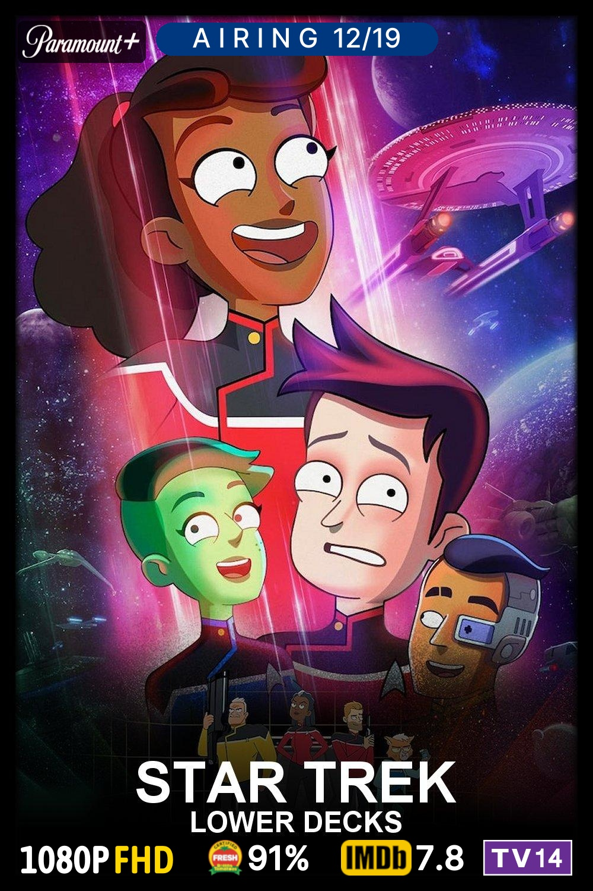
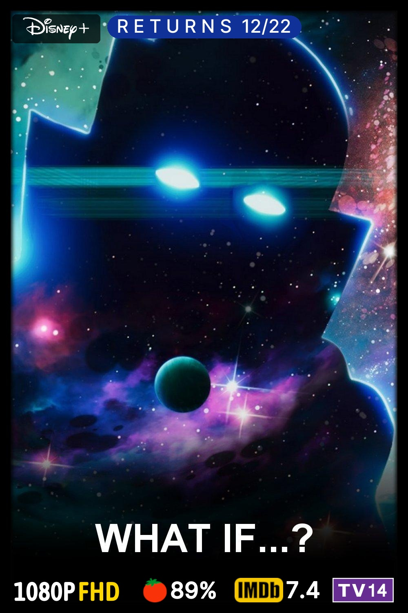
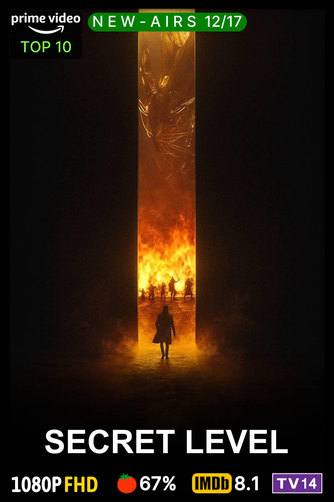
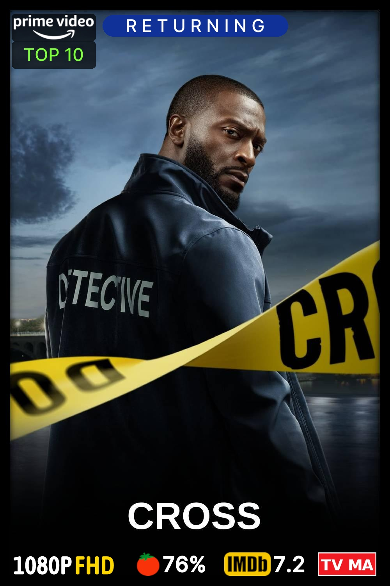
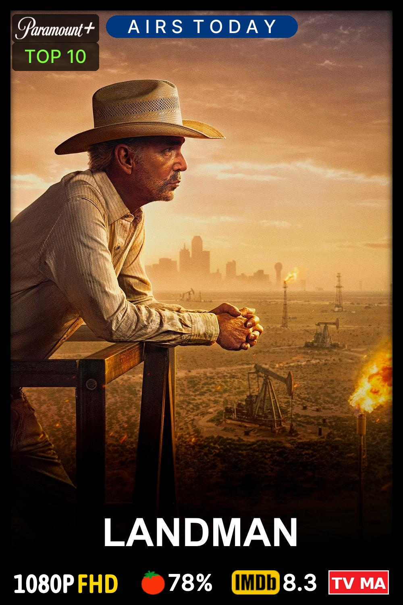
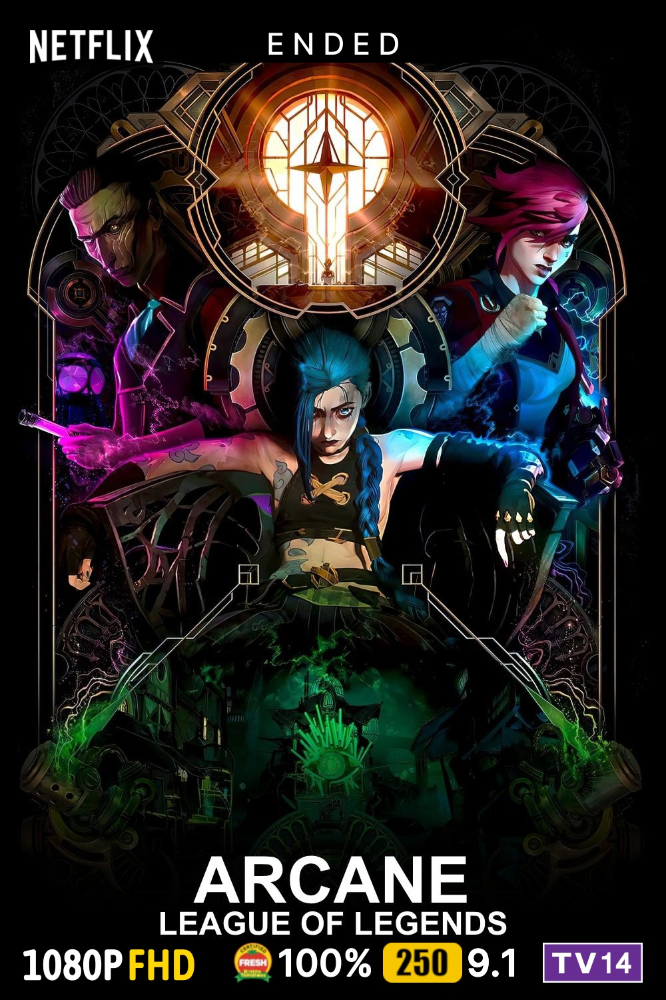
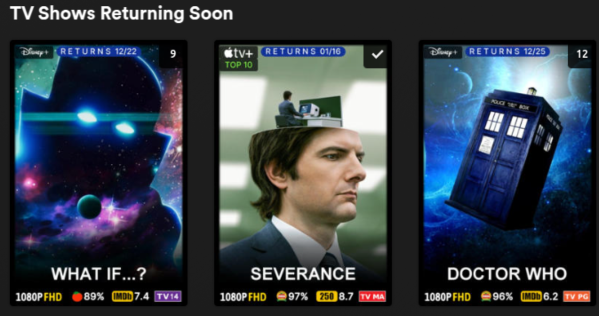

<div align="center"><h1>STATUS-OVERLAY</h1></div>

<div align="center">Creates customized YAML files that can be used in <a href="https://github.com/Kometa-Team/Kometa">Kometa</a> overlays showing airing status on posters.</div>    
<div align="center">(Upcoming, Returning, Ended, Canceled, New Series,</div>
<div align="center">New - Airs MM/DD, Airing, Airs Next MM/DD, and Returns MM/DD)</div>
<div align="center">It can also create a 'Returning Soon' collection to display shows that will return to airing</div>
<br>
<div align="center">Inspired from <a href="https://github.com/InsertDisc/pattrmm">pattrmm</a> by InsertDisc</div>
<br>
<div align="center"> Example Posters </div>
<div align="center">      </div>
<div align="center">      </div>
<div align="center"> Example Collection </div>
<div align="center"></div>

## What does this script do?
If you are using [Kometa](https://github.com/Kometa-Team/Kometa) to manage your Plex Media Server, status-overlay can create .yml files used by Kometa to create a status overlay on your posters that will show users the airing status of the TV show media in your library.  The default status overlay in Kometa shows returning, ended, and canceled show status. Status-overlay created YAML files can ask Kometa to add airing and returning dates that are updated daily to give users more information. (My significant other loves to know when her shows are on and returning with a quick glance!)  

Status-overlay can also create a 'Returning Soon' collection YAML that will display on Plex's home and library recommendation pages.

## How does this script work?
Once setup, the script will create a default-settings file in the main config folder (see below) that will allow you to customize the look of your overlays. You can adjust the size, color, font, location, etc. of your overlay to your liking.  You must have knowlege of how Kometa uses these settings or use the default status settings to create overlays just like in the pictures above.

After adjusting your settings file, you will run the script again. It will then create a YAML for each library designated in the settings file. These YAML files can be created in your config folder, directly where you keep your Kometa overlay YAMLs, or other locations you choose.  The script will run on a schedule and adjust the dates in the YAML daily to upsate the overlay dates.

## Getting Started
See the status-overlay [Wiki](https://github.com/dweagle/status-overlay/wiki) for more help.

1. Install status-overlay locally or use the docker image to create a docker container (see below).

2. Start the script/container to have it create your settings file.  Adjust settings to your liking.

3. After adjusting your settings, start the script/container again.  The YAML files will be created at your designated location from the settings file.

4. Adjust your Kometa config [(using files)](https://kometa.wiki/en/latest/config/files/#location-types-and-paths) to use these YAML files in your overlay settings. Run Kometa to apply.

5. Set your daily schedule for your script/container and enjoy!

# Default Settings File

```YAML
# Settings for overlay configurations
Kometa can use TMDB Dicover api to grab series info to find air dates, etc.  Using the default settings
in this file limits the "junk" show results that are pulled for a library with mainly US, English language shows.  
You will get less "No TVDB/TMDB id" errors in Kometa when it parses this info.

If you have an anime library or a TV show library with lots of non English shows, it may be best
to NOT use watch_region or with_original_language settings.

libraries:                   # Plex library (SHOWS ONLY) names to create Kometa overlays for.
  TV Shows:                  # Change, add, or remove - Need at least one library.
    is_anime: False          # True removes TMDB with_original_language:'en' setting for use with Anime libraries or libraries with non English shows.         
    use_watch_region: True   # False removes TMDB watch_region and watch_monetization settings.
  4k TV Shows:
    is_anime: False
    use_watch_region: True
  Anime:
    is_anime: True
    use_watch_region: True

# These settings are used across all status overlays.  
# This creates a consistent overlay across all shows.    
overlay_settings:                  
  days_ahead: 28                # Days ahead for Returning Next (30 Days Max).
  overlay_save_folder:          # Kometa overlay folders (leave blank for config folder). Kometa must have permissions to this folder
  font:                         # Path placed in final yaml for Kometa to use. Kometa ust have permissions for this folder. Will default to included font in 'config/fonts/Inter-Medium.ttf'.
  font_size: 45                 # Font size for overlay text.
  font_color: "#FFFFFF"         # Font color (kometa requires #RGB, #RGBA, #RRGGBB or #RRGGBBAA, e.g., #FFFFFF).
  horizontal_align: center      # Horizontal alignment (e.g., center, left, right).
  vertical_align: top           # Vertical alignment (e.g., top, bottom, etc.).
  horizontal_offset: 0          # Horizontal offset in pixels.
  vertical_offset: 38           # Vertical offset in pixels.
  back_width: 475               # Width of the overlay background.
  back_height: 55               # Height of the overlay background.
  back_radius: 30               # Corner radius for rounded backgrounds.
  ignore_blank_results: "true"  # Kometa error processing (true or false).

  # TMDB DISCOVER SETTINGS #    SEE TMDB API FOR MORE DETAILS - THESE DEFAULT SETTINGS ARE IDEAL.
  with_status: 0                # TMDB DISCOVER - Returning Series: 0 Planned: 1 In Production: 2 Ended: 3 Canceled: 4 Pilot: 5.
  watch_region: US              # TMDB DISCOVER - Default US - Must be valid TMDB region code.
  with_original_language: en    # TMDB DISCOVER - Default is en (English) - Must Be valid TMDB language code.
  limit: 500                    # TMDB DISCOVER - API Results limit. Default is 500.
  with_watch_monetization_types: flatrate|free|ads|rent|buy  # TMDB DISCOVER - Options: flaterate, free, ads, rent, buy - can use ,(and) or |(or) as separators.

# You can decide here if you want to use each overlay, change font or backdrop color for individual overlays, or change the text.
use_overlays:
  upcoming_series:
    use: True                   # Use this overlay: True or False.
    back_color: "#FC4E03"       # Default is "#fc4e03" - Overlay color override for this overlay only.
    text: "U P C O M I N G"     # Change to desired spacing/text.
    font_color: "#FFFFFF"       # font color override for this overlay only (Kometa requires #RGB, #RGBA, #RRGGBB or #RRGGBBAA).
    
  new_series:
    use: True
    back_color: "#008001"       # Default is "#008001".
    text: "N E W  S E R I E S"
    font_color: "#FFFFFF"

  new_airing_next:
    use: True
    back_color: "#008001"       # Default is "#008001".
    text: "N E W - A I R S"     # Displays as N E W - A I R S 12/22 on overlays.
    font_color: "#FFFFFF"

  airing_series:
    use: True
    back_color: "#003880"       # Default is "#003880".
    text: "A I R I N G"
    font_color: "#FFFFFF"

  airing_today:
    use: True
    back_color: "#003880"       # Default is "#003880".
    text: "A I R S  T O D A Y"
    font_color: "#FFFFFF"

  airing_next:
    use: True
    back_color: "#003880"       # Default is "#003880".
    text: "A I R I N G "        # Displays as A I R I N G  12/23 on overlays.
    font_color: "#FFFFFF"

  ended_series:
    use: True
    back_color: "#000000"       # Default is "#000000.
    text: "E N D E D"
    font_color: "#FFFFFF"

  canceled_series:
    use: True
    back_color: "#CF142B"       # Default is "#CF1428".
    text: "C A N C E L E D"
    font_color: "#FFFFFF"

  returning_series:
    use: True
    back_color: "#103197"       # Default is "#103197".
    text: "R E T U R N I N G"
    font_color: "#FFFFFF" 

  returns_next:
    use: True
    back_color: "#103197"       # Default is "#103197"
    text: "R E T U R N S "      # Displays as R E T U R N S  12/23 on overlays.
    font_color: "#FFFFFF"     

# Creates a Returning Soon collection yml file that can be used in Kometa to display a collection in Plex
returning_soon_collection:
  use: True                     # True to create collection yml. False to not create.
  collection_save_folder:       # Path to collection yml folder (leave blank for /config folder). Kometa-must have permissions to this folder.
  poster_source: url            # url or file.  url for outside source, file for local poster. Defaults to url and kometa github poster.  
  poster_path:                  # Path placed in final yaml for Kometa to use. Kometa ust have permissions for this folder  Can be a url link or file path. Defaults to url Kometa git html poster.
  visible_home: "true"          # Collecition visible on home page.  "true" or "false"
  visible_shared: "true"        # Collection visible on friends/users home page. "true" or "false"
  summary: "TV Shows returning soon!"
  minimum_items: 1
  delete_below_minimum: 'true'
  sort_title: "!010_Returning"
```

# Docker Setup
### Image available on [dockerhub](https://hub.docker.com/r/dweagle/status-overlay)
Example Docker CLI:
```
docker run -d \
  --name status-overlay \
  --user 1000:1002 \
  -e TZ=America/New_York \
  -e SCHEDULE=06:00 \
  -e RUN_NOW=false \
  -v /path/to/status-overlay/config:/config:rw \
  -v /path/to/kometa/overlays:/path/to/kometa/overlays:rw \
  --restart unless-stopped \
  dweagle/status-overlay:latest
```
Eample Docker Compose:
```YAML
services:
  status-overlay:
    image: dweagle/status-overlay:latest
    container_name: status-overlay
    user: 1000:1002
    environment:
      - TZ=America/New_York  # System time and called for some overlays
      - SCHEDULE=06:00       # Schedule run time
      - RUN_NOW:false        # true will bypass the schedule once on container startup
    volumes:
      # Mount your local directory to the containers internal config folder.
      # By default, the logs, settings, and overlays will be created here.
      - /path/to/status-overlay/config:/config:rw 
      # If you want overlay files to go to a seperate folder, ex. inside kometa, do
      # another mount to the save folder you entered in the settings (overlay_save_folder:)
      # Make sure the path matches the settings file path.
      - /path/to/kometa/overlays:/path/to/kometa/overlays:rw
    restart: unless-stopped  
```
### Manual Run
If you are doing testing on your overlay settings and don't want to restart the container multiple times or set the env RUN_NOW variable to true, you can connect to the running container and run the following command.  It will run the main.py script and do a complete run.
```ruby
python3 main.py -r
or
python3 main.py --run-now
```
# Local Setup (Linux)
Local setup requires a recent version of Python to be installed.

1. Clone the repository to your home directory and then enter that directory.
```YAML
git clone https://github.com/dweagle/status-overlay
cd status-overlay
```
2. Inside that directory create a virtual environment.
```YAML
python3 -m venv status-overlay-venv
```
3. Activate the virtual environment.
```YAML
source status-overlay-venv/bin/activate
```
4. Install any python requirements.
```YAML
python3 -m pip install -r requirements.txt
```
5. Run status-overlay. This will create a settings file that you can edit your overlay and the Returning Soon Collection preferences. This runs the script one time and exits.
```YAML
python3 main.py -r
```
6. After adjusting your settings, run the script again to create your Kometa YAMLs.
```YAML
python3 main.py -r
```
7. Deactivate your virtual environment
```YAML
deactivate
```
8. You can return to this virtual environment daily and run the script manually using the commands from above. Or, set up a cron job for automated daily scheduling using the command below along with your cron job settings. A runtime set anytime before your Kometa run should would be ideal.  This will ensure Kometa has updated dates in the YAML files.
```YAML
cd /path/to/status-overlay && status-overlay-venv/bin/python3 main.py -r 
```
